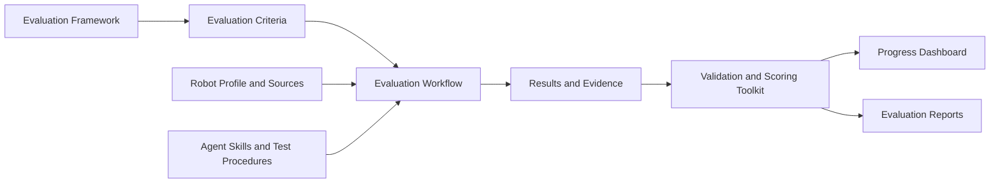

# GR00T-Ready Evaluation

GR00T-Ready defines the technical requirements and validation procedures for
robot platforms integrating with Project GR00T. The framework covers the full
integration surface — whole-body motion control, sensor and actuator fidelity,
embedded compute, middleware compatibility, end-effector manipulation,
teleoperation, simulation readiness, security, and OTA capability — and is
designed to surface integration challenges early, before significant
development effort is invested.

Two tracks are available for developers:

- **Self-Serve** supports teams pursuing independent integration, with access
  to NVIDIA's tooling, documentation, and validation procedures.
- **GR00T-Ready Verified** follows the same technical baseline and adds
  commercial and operational criteria — supply-chain scalability, compliance
  posture, support infrastructure, and developer documentation.

Both tracks are evaluations of platform readiness; completing them does not
constitute an application or formal agreement with NVIDIA.

<p align="center"></p>

The evaluation criteria are described in the
[GR00T-Ready Evaluation Framework](GR00T_Ready_Evaluation_Framework.md).

## Project workflow



The framework defines what readiness means, while the criteria turn it into a
consistent evaluation. Robot information and test procedures feed the workflow;
the resulting scores and evidence are then validated and presented in the
dashboard and reports.

## Quick start

### 1. Install the requirement

GR00T-Ready Evaluation requires Python 3.10 or newer and PyYAML.

```bash
python3 -m pip install pyyaml
```

Some robot tests may also require the robot vendor's SDK, ROS, or other tools.

### 2. Create a workspace for your robot

Copy the provided template and give the new folder a short, recognizable name:

```bash
cp -r robots/_template robots/my_robot
```

Then update:

- `robots/my_robot/robot.yaml` with the robot name, connection information, and
  known specifications;
- `robots/my_robot/sources.yaml` with links or paths to the robot documentation
  and SDK.

### 3. Create the evaluation checklist

```bash
python3 -m gr00t_ready checklist robots/my_robot
```

This creates `robots/my_robot/results/results.yaml`. Update its date and
evaluator fields, then use it to record scores, notes, and evidence as tests are
completed.

### 4. Follow progress in the dashboard

```bash
python3 -m gr00t_ready serve robots/my_robot
```

Open <http://localhost:8321/> in a browser. The dashboard updates automatically
as results are recorded. It shows completed, pending, blocked, invalid, and
skipped items, along with the current score and must-have status.

The dashboard is available only on the local computer by default. To make it
available on a trusted local network, add `--host 0.0.0.0`. This exposes
evaluation data to that network, so do not use it on an untrusted network.

### 5. Check results and create a report

```bash
python3 -m gr00t_ready validate robots/my_robot
python3 -m gr00t_ready score robots/my_robot
python3 -m gr00t_ready report robots/my_robot
```

The report is written to `reports/my_robot/` and includes the overall result,
must-have status, gate summaries, blockers, gaps, and detailed evidence.

## How an evaluation works

Each checklist item is completed in one of three ways:

- **Automatic:** a script can perform the check.
- **Guided:** a script performs the check with help from an operator.
- **Manual:** an operator follows written steps and records the outcome.

For each item, record the score and enough evidence for another person to
understand the result. Evidence can include log files, notes, photos, or videos.
The dashboard provides password-protected photo and video uploads.

If you use the included agent-assisted workflow, see [AGENT.md](AGENT.md) and
the instructions under `skills/`.

## Understanding scores

Most items use a simple three-level scale:

- **0:** not supported or not working;
- **1:** partly supported;
- **2:** fully supported.

Items are grouped into gates such as hardware, sensors, simulation, and
security. A gate is:

- **Pass** when every applicable item reaches its highest score;
- **Conditional** when all applicable items work but some only have partial
  support;
- **Fail** when an applicable item scores 0;
- **Incomplete** when required testing is not finished.

Some items are marked as **must-have**. These must reach their required score
before the platform can meet the certification baseline.

Two additional results are available when a numeric score is not appropriate:

- **Invalid:** the robot does not have the feature being evaluated, and the
  criterion allows that feature to be absent;
- **Skipped:** the test cannot be completed yet and has been deferred.

Invalid and skipped items are not included in score totals.

## Command reference

Run commands from the repository root with
`python3 -m gr00t_ready <command>`.

| Command | Purpose |
| --- | --- |
| `--version` | Show the evaluation pipeline version. |
| `items` | List all evaluation items. |
| `checklist robots/my_robot` | Create a results checklist. |
| `validate robots/my_robot` | Check the results file for errors. |
| `score robots/my_robot` | Show the current score and gate results. |
| `board robots/my_robot` | Create a Markdown progress board. |
| `report robots/my_robot` | Create a detailed evaluation report. |
| `serve robots/my_robot` | Start the live dashboard. |

Use `python3 -m gr00t_ready <command> --help` for command-specific options.

## Evaluation versions

The current pipeline version is stored in [VERSION](VERSION). A new checklist
automatically records this version, and it is shown in scores, boards,
dashboards, and reports. This makes it clear which version of the evaluation
was used for a result.

Check the installed version with:

```bash
python3 -m gr00t_ready --version
```

## Where files are stored

- `robots/my_robot/` contains the robot profile, tests, results, and progress
  board.
- `robots/my_robot/results/media/` contains uploaded photos and videos. This
  directory is ignored by Git, so back it up separately if the evidence must be
  retained.
- `reports/my_robot/` contains generated reports.
- `criteria/criteria.yaml` contains the checklist and scoring criteria.

## Security

To report a security issue, follow the instructions in [SECURITY.md](SECURITY.md).
Do not report security vulnerabilities through a public issue.

## Contributing

Outside contributions are welcome. See [CONTRIBUTING.md](CONTRIBUTING.md) for
development and pull request guidance. All commits must include a Developer
Certificate of Origin sign-off; this project does not require a Contributor
License Agreement.

## License

This project is licensed under the [Apache License 2.0](LICENSE).
